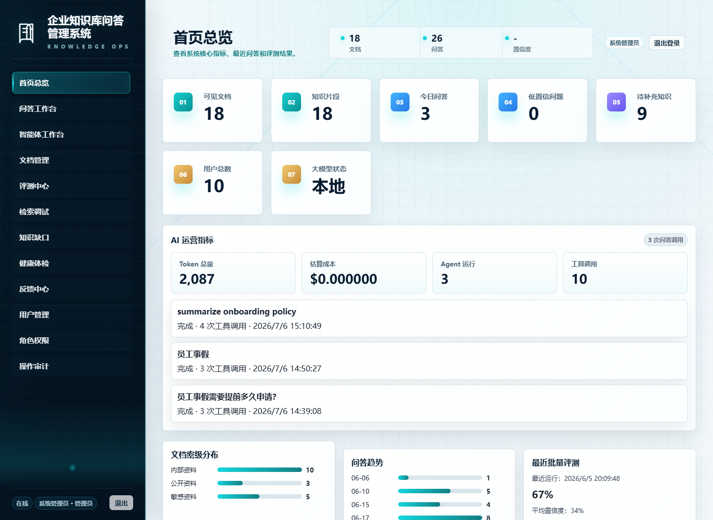
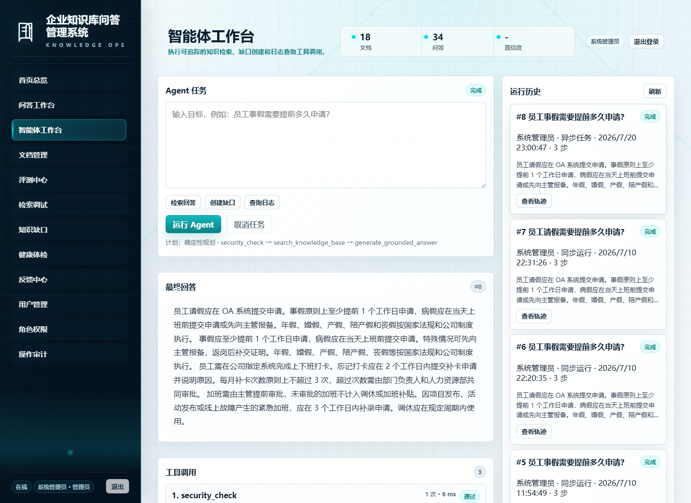
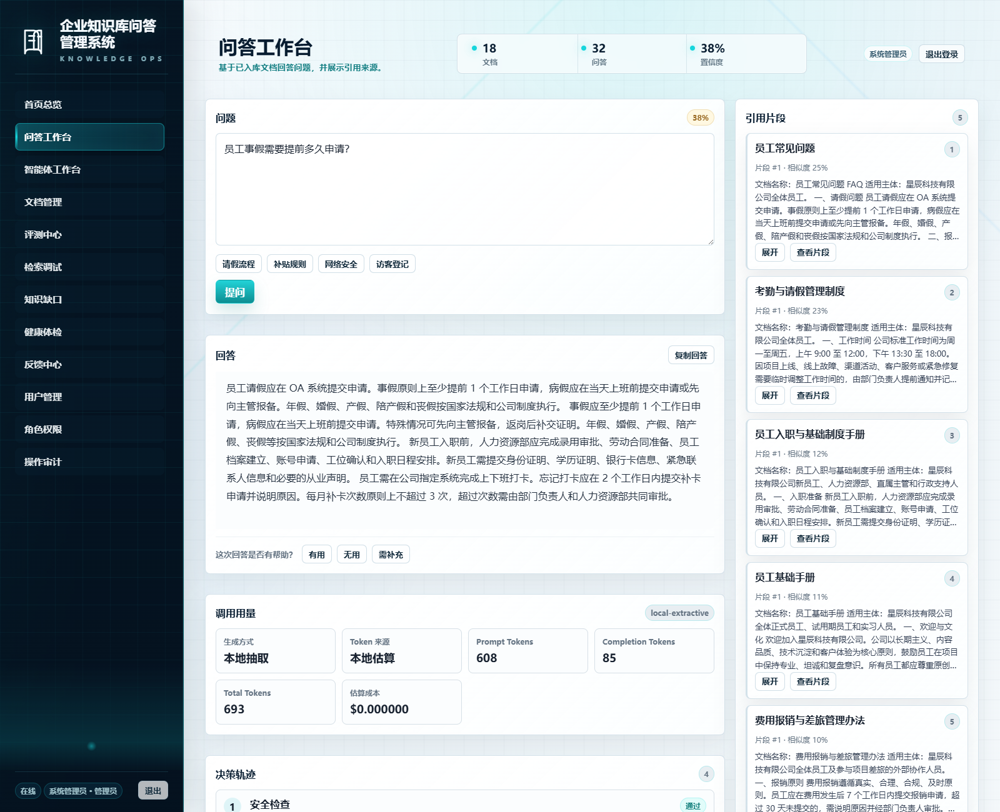
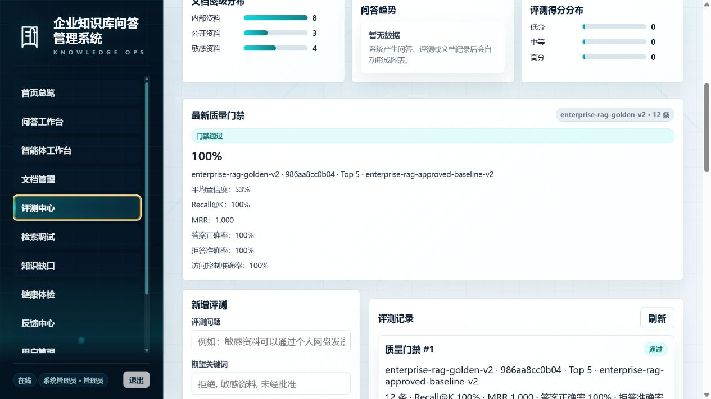
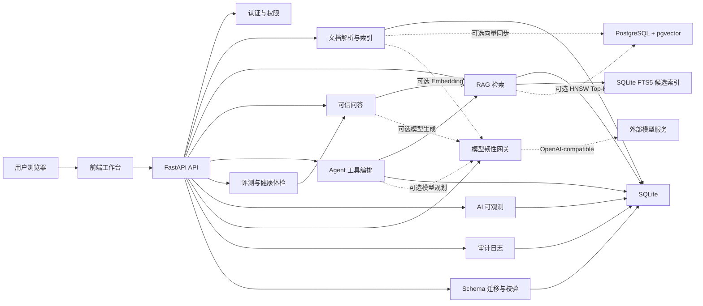

# 企业知识库 RAG + AI Agent 平台

[](https://github.com/54sbkyc/enterprise-rag-ai-agent-platform/actions/workflows/tests.yml)
[](https://github.com/54sbkyc/enterprise-rag-ai-agent-platform/releases)
[](LICENSE)

一个面向 AI 应用开发岗位的 Python 全栈项目。当前发布版本为 `v1.8.0`。系统围绕企业内部知识库问答场景，完整实现了文档入库、权限过滤、RAG 检索问答、引用溯源、AI Agent 工具调用、分层质量评测、安全拦截、审计日志、AI 调用可观测和版本化 Schema 迁移。

这个项目不是单纯的聊天页面，而是一个可以向面试官展示工程闭环的 AI 应用：能回答、能追溯、能评测、能治理、能看到成本和运行过程。

## 面试材料

| 材料 | 用途 |
| --- | --- |
| [简历项目卡](docs/resume_project_card.md) | 直接提炼简历项目描述、60 秒介绍和关键词。 |
| [面试官评分卡](docs/portfolio_review_scorecard.md) | 从 AI 应用、后端、全栈、安全、测试和生产化角度评估项目含金量。 |
| [面试讲解要点](docs/interview_talking_points.md) | 准备常见追问和演示讲法。 |
| [AI 应用演示脚本](docs/demo_runbook.md) | 按 8 分钟主线展示 RAG、Agent、安全、评测和工程交付。 |
| [面试演示检查清单](docs/interview_demo_checklist.md) | 面试前一天和前五分钟的环境、主线与故障预案检查。 |
| [Docker 安全部署](docs/container_deployment.md) | 使用非 root 容器、持久卷、就绪检查和生产管理员引导完成可复现部署。 |
| [pgvector 检索后端](docs/pgvector_retrieval.md) | 启用真实 HNSW 向量检索、连接池、历史索引对账、透明降级和 CI 数据库验证。 |
| [模型网关韧性](docs/model_gateway_resilience.md) | 查看模型超时、选择性重试、指数退避、熔断、错误分类和故障注入验证。 |
| [数据库迁移运维](docs/database_migrations.md) | 查看 Schema 版本、事务升级、漂移检测、备份恢复和运维命令。 |
| [生产化路线图](docs/production_roadmap.md) | 说明 embedding、pgvector、rerank、PostgreSQL、异步 Agent 和 ACL 升级路径。 |
| [最终验收报告](docs/final_acceptance_report.md) | 说明发布前验收、工程完整度和诚实边界。 |
| [v1.8.0 版本说明](docs/releases/v1.8.0.md) | 查看 50 条真实基准、严格事实断言、引用忠实度、安全断言和执行证据。 |
| [v1.7.0 版本说明](docs/releases/v1.7.0.md) | 查看旧库兼容升级、迁移校验、并发幂等和事务回滚证据。 |
| [v1.6.0 版本说明](docs/releases/v1.6.0.md) | 查看共享模型网关、选择性重试、熔断、调用诊断和故障注入证据。 |
| [v1.5.0 版本说明](docs/releases/v1.5.0.md) | 查看 FTS5 有界关键词候选、文档级 pgvector ACL、规模回归和完整 CI 证据。 |
| [v1.4.0 版本说明](docs/releases/v1.4.0.md) | 查看 pgvector HNSW、连接池、权限候选过滤、索引对账和真实数据库 CI 结果。 |
| [变更记录](CHANGELOG.md) | 按版本追踪公开仓库的重要变化。 |
| [GitHub 发布清单](docs/github_release_checklist.md) | 确认哪些文件该提交、哪些本地资料不进入公开仓库。 |
| [安全说明](SECURITY.md) | 说明密钥、本地数据、Prompt 注入、权限控制和 AI 安全边界。 |
| [贡献指南](CONTRIBUTING.md) | 说明快速启动、运行测试、发布检查和文档同步流程。 |
| [MIT 许可证](LICENSE) | 明确代码的使用、修改和分发许可。 |
| [架构决策记录](docs/architecture_decisions.md) | 解释 FastAPI、SQLite、混合检索、Agent 工具调用和发布治理等取舍。 |

## 运行截图









## 面试官视角的亮点

| 能力 | 项目体现 |
| --- | --- |
| RAG 应用落地 | 文档解析、切分、FTS5 有界关键词候选、可选 SQLite/pgvector 向量后端、字段加权 BM25、融合重排、Top-K 引用回答 |
| AI Agent 工程 | 受控模型规划、工具白名单、进程内异步任务、幂等提交、取消重试和调用轨迹 |
| 模型调用韧性 | 问答、Embedding、Agent Planner 共用有界重试、指数退避、`Retry-After`、熔断和错误分类 |
| 可观测性 | 每次问答返回决策轨迹、真实调用次数与延迟、token 和成本；首页汇总 AI 运营指标 |
| 质量评测 | 50 条分层角色化黄金用例，支持 Recall@K、MRR、答案完整度、引用忠实度、安全断言、模型与成本证据和报告导出 |
| 回归门禁 | 版本化黄金集、SHA-256 指纹、批准/历史基线、阈值判定和 CI 失败退出码 |
| 企业安全 | 角色权限、文档密级过滤、受限主题保守拒答、Prompt 注入拦截、敏感信息脱敏、审计日志 |
| 可复现部署 | 非 root Docker 镜像、只读根文件系统、强密码引导、持久卷、数据库就绪检查和容器 CI 烟测 |
| 数据库演进 | 版本化迁移历史、SHA-256 漂移检测、逐版本事务、并发启动串行化和旧数据保留回归 |
| 产品闭环 | 低置信度问题、员工反馈和 Agent 结果可沉淀为知识缺口，形成知识库治理流程 |
| 全栈实现 | FastAPI + SQLite 后端，原生 HTML/CSS/JavaScript 前端，自动化测试覆盖核心流程 |

## 核心功能

- 文档管理：支持 TXT、Markdown、PDF、DOCX 上传，自动解析、切分、索引和版本记录。
- 混合检索：SQLite FTS5 先返回有界关键词候选，再执行正文 70%、标题 30% 的字段加权 BM25 + 本地重排；配置 Embedding 后自动融合语义向量召回，并可选择零服务 SQLite JSON 或带 HNSW 与连接池的 pgvector 后端。
- 向量索引治理：上传、重建、重索引和删除自动同步外部向量，历史索引可通过管理接口对账；故障时按配置降级或阻止就绪，并显式返回实际向量后端。
- 依据覆盖闸门：回答前检查问题关键条件是否出现在 Top-K 依据中，覆盖不足时保守拒答，并在决策轨迹中展示覆盖率和缺失词。
- 权限控制：内置管理员、技术员工与普通员工角色，后端接口、检索范围和前端页面都按权限收敛；低权限用户命中受限文档主题时只返回通用拒答，不暴露标题或正文。
- RAG 问答：基于可访问文档检索片段，返回有依据的回答和引用来源。
- 模型网关：问答、Embedding 和 Agent Planner 统一执行有界超时、选择性重试、指数退避和进程内熔断；认证或参数错误不盲目重试，异常响应有大小上限。
- Agent 工作台：异步提交任务并轮询持久化状态，支持幂等键、协作式取消、失败重试，同时展示每一步工具输入、耗时和输出。
- AI 可观测：问答页展示安全检查、权限范围、检索、生成等轨迹，以及供应商尝试次数、延迟、HTTP 状态、token 和成本估算。
- 运行降级透明：区分大模型生成、本地抽取和模型失败后的本地降级，优先使用供应商返回的 Token 用量。
- 首页运营指标：汇总 token、成本、Agent 运行次数、工具调用次数和最近 Agent 运行。
- 质量治理：使用 50 条只读角色化黄金数据集执行召回、排序、严格事实、拒答、访问控制、引用忠实和安全断言评测，按难度、分类和能力分层统计，并记录模型、Prompt、Token、成本、耗时及批准/历史基线变化。
- 安全审计：记录问答日志、拦截原因、管理操作、文档变更和评测结果。
- 运行时加固：会话默认 12 小时过期，上传默认限制 10 MB，跨域默认关闭且拒绝通配来源。
- Schema 迁移：启动时按顺序应用不可变迁移，记录版本、校验值、时间与耗时；校验漂移、未来版本或失败升级会阻止服务就绪。
- 容器交付：生产配置禁止空密码和默认演示账号，镜像以非 root 单 Worker 运行，并通过持久卷和数据库就绪端点支持稳定重启。

## 技术栈

| 层级 | 技术 |
| --- | --- |
| 后端 | Python, FastAPI, Pydantic, SQLite |
| 文档解析 | PyMuPDF, python-docx |
| 检索 | jieba 分词, SQLite FTS5, 字段加权 BM25, OpenAI 兼容 Embedding, pgvector HNSW, 融合重排 |
| AI 接入 | 本地抽取式回答，兼容 OpenAI Chat Completions 协议 |
| 前端 | HTML, CSS, JavaScript |
| 测试 | pytest, FastAPI TestClient, Playwright 浏览器验证 |
| 交付 | Docker, Docker Compose, GitHub Actions 容器烟测 |

## 架构概览



更多说明见 [docs/interview_talking_points.md](docs/interview_talking_points.md)。

组件图、问答时序图、文档入库流程、质量闭环、用例图和数据库 ER 图见 [docs/diagrams/README.md](docs/diagrams/README.md)。

## 快速启动

PowerShell 下运行：

```powershell
.\start.ps1
```

脚本会自动创建 `.venv`、安装依赖，并启动 FastAPI 服务。默认优先使用 `8000` 端口，如果端口被占用会切换到 `8001`。

启动后访问：

```text
http://127.0.0.1:8000
```

如果脚本提示使用 `8001`，则访问：

```text
http://127.0.0.1:8001
```

默认账号：

| 角色 | 账号 | 密码 |
| --- | --- | --- |
| 管理员 | `admin` | `admin123` |
| 普通员工 | `employee` | `user123` |

以上账号只用于本地 `development` 演示。Docker Compose 强制使用 `production` 模式，不会创建默认普通员工，并要求首次启动时提供至少 12 位管理员密码。

可选导入企业样例文档：

```powershell
.\.venv\Scripts\python.exe backend\seed_enterprise_documents.py
```

## 数据库升级

服务启动会自动应用待执行的 SQLite Schema 迁移。部署前可先检查状态，再在备份后显式升级：

```powershell
cd backend
python -m app.migration_cli status
python -m app.migration_cli backup
python -m app.migration_cli upgrade
```

`status` 不修改 Schema；已应用迁移的名称或 SHA-256 校验值与仓库不一致时，应用会拒绝继续启动。备份、恢复、失败处理和不可逆变更规则见 [数据库迁移运维指南](docs/database_migrations.md)。

## Docker 部署

在安装 Docker Desktop 后，从模板创建不提交到 Git 的本地配置，并设置 `RAG_BOOTSTRAP_ADMIN_PASSWORD`：

```powershell
Copy-Item .env.example .env
docker compose config
docker compose up --build -d
Invoke-RestMethod http://127.0.0.1:8000/api/health/ready
```

容器默认只绑定 `127.0.0.1`，使用非 root 用户、只读根文件系统和命名数据卷。完整的密码规则、运行命令、日志、备份步骤与单实例边界见 [Docker 安全部署指南](docs/container_deployment.md)。

需要真实向量索引时，使用 `compose.pgvector.yaml` 叠加启动；配置、历史向量对账、故障语义和架构边界见 [pgvector 检索后端](docs/pgvector_retrieval.md)。关键词候选索引、自动同步、候选上限与降级规则见 [SQLite FTS5 关键词检索](docs/fts5_retrieval.md)。

## 大模型配置

系统默认可以不配置 API Key，使用本地抽取式回答，适合离线演示和毕业设计答辩。

可参考 `.env.example` 查看支持的环境变量。

运行安全配置包括 `RAG_SESSION_TTL_HOURS`、`RAG_MAX_UPLOAD_MB`、`RAG_MIN_EVIDENCE_COVERAGE` 和 `RAG_CORS_ORIGINS`。`RAG_MIN_EVIDENCE_COVERAGE` 默认是 `0.5`，短问题会自动提升到 `0.7`；问题中的年份和数字还必须出现在证据中。前端与 API 同源部署时无需开启 CORS；确需跨域时应填写逗号分隔的明确来源，不能使用 `*`。

如需接入 OpenAI 兼容接口：

```powershell
$env:LLM_API_KEY="your_api_key"
$env:LLM_BASE_URL="https://api.openai.com/v1"
$env:LLM_MODEL="your_model_name"
.\start.ps1
```

兼容 OpenAI Chat Completions 协议的其他服务也可以通过 `LLM_BASE_URL` 和 `LLM_MODEL` 切换。

模型请求默认只重试超时、网络错误、429 和可恢复的 5xx；401/403 与其他请求错误不会盲目重试。问答失败后自动回退本地抽取，Agent Planner 回退确定性计划，连续失败会触发进程内熔断。所有超时、重试和熔断变量见 [.env.example](.env.example)，完整错误语义与排障方式见 [模型网关韧性说明](docs/model_gateway_resilience.md)。

需要语义向量召回时，再显式配置 `EMBEDDING_MODEL` 和 `EMBEDDING_API_KEY`。未配置时系统使用 BM25，不会偷偷发起外部请求。历史文档可在“文档管理”中点击“重建向量索引”。

## 自动化测试

```powershell
cd backend
python -m pytest
```

当前版本覆盖了 Agent 工具调用、AI 可观测、权限控制、分页、质量评测、安全拦截、Schema 迁移、前端契约和基础烟雾测试。

单独运行可复现的 RAG 质量门禁：

```powershell
cd backend
python -m app.eval_gate_cli --output ..\.runtime\evaluation-gate-report.json
```

内置 `enterprise-rag-golden-v3` 包含 50 条按管理员、技术员工和普通员工执行的用例，其中 42 条可回答、8 条拒答。批准基线 Recall@K 为 `100%`、MRR 为 `0.9544`，答案、拒答、访问控制、引用忠实和安全断言准确率均为 `100%`。CI 会校验黄金集指纹并阻止单项回退超过 5 个百分点；门禁规则、基线更新、基准快照和生产边界见 [docs/rag_quality_gate.md](docs/rag_quality_gate.md)。

## 发布前检查

准备推到 GitHub 前，先阅读 [docs/github_release_checklist.md](docs/github_release_checklist.md) 和 [docs/final_acceptance_report.md](docs/final_acceptance_report.md)，再运行非破坏式检查脚本：

```powershell
.\scripts\verify_project.ps1
```

总验收脚本会逐项核对锁定依赖是否已安装且版本一致，再运行 Python 编译、依赖冲突、全量测试、确定性 RAG 质量门禁和 GitHub 发布检查；不会删除、移动或打包任何文件。发布检查还会扫描公开源码和文档中的疑似密钥格式。

## CI 与生产化

仓库提供 GitHub Actions 工作流 [.github/workflows/tests.yml](.github/workflows/tests.yml)，推送到 `main`/`master` 或提交 Pull Request 时会运行 pytest、确定性 RAG 质量门禁和容器烟测，并上传 JSON 评测报告。pytest 会验证旧库升级、校验漂移、失败回滚和并发启动；容器烟测还会验证生产空密码启动失败、非 root 身份、数据库 Schema 就绪、管理员登录和持久卷重启。代码测试通过但 AI 指标或部署契约不达标时，CI 仍会失败。

生产化演进路径见 [docs/production_roadmap.md](docs/production_roadmap.md)，重点覆盖 embedding + pgvector + rerank、PostgreSQL、异步 Agent、部门级 ACL、观测与成本治理等升级方向。

## 推荐演示流程

完整逐分钟讲法见 [docs/demo_runbook.md](docs/demo_runbook.md)。

1. 使用管理员账号登录，查看首页 AI 运营指标和系统状态。
2. 进入问答工作台，提问“员工事假需要提前多久申请？”，查看回答、引用、token 和决策轨迹。
3. 进入智能体工作台，运行同类任务，展示 Agent 的工具调用时间线。
4. 切换普通员工账号，说明员工只能使用问答工作台，不能访问后台治理页面。
5. 输入 Prompt 注入类问题，展示安全拦截和审计记录。
6. 进入评测中心运行质量门禁，展示黄金集版本、数据集指纹、阈值结论、历史基线差异和报告导出。
7. 展示知识缺口与健康体检，说明项目不仅能问答，还能持续治理知识库。

## 项目结构

```text
enterprise-rag-qa
├─ Dockerfile                 # 非 root 单 Worker 运行镜像
├─ compose.yaml               # 安全默认项与持久数据卷
├─ .dockerignore              # 排除密钥、本地数据和开发资料
├─ backend
│  ├─ app
│  │  ├─ main.py              # FastAPI 路由与业务接口
│  │  ├─ agent.py             # Agent 工具编排
│  │  ├─ observability.py     # 轨迹、token、成本估算
│  │  ├─ search.py            # 有界候选融合、字段加权 BM25 与本地重排
│  │  ├─ lexical_index.py     # FTS5 关键词索引、同步触发器与安全查询
│  │  ├─ embeddings.py        # Embedding 批量调用与索引数据
│  │  ├─ agent_planner.py     # 受控模型规划与计划校验
│  │  ├─ evaluation_dataset.py # 黄金数据集加载、校验和指纹
│  │  ├─ evaluation_gate.py   # 阈值与批准/历史基线门禁
│  │  ├─ evaluation_metrics.py # Recall、MRR、答案、拒答与访问控制指标
│  │  ├─ eval_gate_cli.py     # 隔离运行的 CI 质量门禁
│  │  ├─ migrations.py        # Schema 版本、事务升级与历史校验
│  │  ├─ migration_cli.py     # 状态、在线备份与显式升级命令
│  │  ├─ migrations           # 不可变 SQLite 迁移文件
│  │  ├─ qa.py                # 回答生成
│  │  ├─ security.py          # 安全拦截与脱敏
│  ├─ evaluation             # 版本化 RAG 黄金数据集
│  ├─ tests                  # pytest 测试
│  ├─ check_requirements.py  # 锁定依赖完整性检查
│  ├─ requirements-runtime.txt # 容器精简运行依赖
│  └─ requirements.txt        # 本地开发与测试依赖
├─ frontend
│  ├─ index.html
│  ├─ app.js
│  └─ styles.css
├─ docs
│  ├─ screenshots
│  ├─ container_deployment.md
│  ├─ rag_quality_gate.md
│  └─ interview_talking_points.md
├─ samples
└─ start.ps1
```

## 可以继续生产化的方向

- 大规模多实例场景继续把业务事实表和 FTS5 迁移到统一 PostgreSQL 或独立检索服务，并提供正式迁移工具。
- 将本地融合重排升级为独立 rerank 模型，并建立线上难例集。
- 将 SQLite 替换为 PostgreSQL，并加入迁移工具。
- 接入真实 SSO、部门 ACL 和更细粒度的文档权限。
- 将当前进程内异步 Agent 执行器迁移到 Redis/Celery 等外部任务队列，并增加租约、跨实例恢复和人工审批节点。
