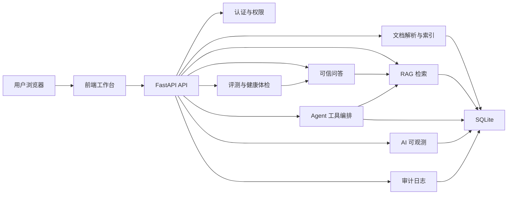

# 企业知识库 RAG + AI Agent 平台

[](https://github.com/sbkyc/enterprise-rag-ai-agent-platform/actions/workflows/tests.yml)
[](https://github.com/sbkyc/enterprise-rag-ai-agent-platform/releases)
[](LICENSE)

一个面向 AI 应用开发岗位的 Python 全栈项目。当前实用性增强版本为 `v1.1.0`。系统围绕企业内部知识库问答场景，完整实现了文档入库、权限过滤、RAG 检索问答、引用溯源、AI Agent 工具调用、问答质量评测、安全拦截、审计日志和 AI 调用可观测。

这个项目不是单纯的聊天页面，而是一个可以向面试官展示工程闭环的 AI 应用：能回答、能追溯、能评测、能治理、能看到成本和运行过程。

## 面试材料

| 材料 | 用途 |
| --- | --- |
| [简历项目卡](docs/resume_project_card.md) | 直接提炼简历项目描述、60 秒介绍和关键词。 |
| [面试官评分卡](docs/portfolio_review_scorecard.md) | 从 AI 应用、后端、全栈、安全、测试和生产化角度评估项目含金量。 |
| [面试讲解要点](docs/interview_talking_points.md) | 准备常见追问和演示讲法。 |
| [AI 应用演示脚本](docs/demo_runbook.md) | 按 8 分钟主线展示 RAG、Agent、安全、评测和工程交付。 |
| [生产化路线图](docs/production_roadmap.md) | 说明 embedding、pgvector、rerank、PostgreSQL、异步 Agent 和 ACL 升级路径。 |
| [最终验收报告](docs/final_acceptance_report.md) | 说明发布前验收、工程完整度和诚实边界。 |
| [v1.1.0 版本说明](docs/releases/v1.1.0.md) | 查看首个公开版本的能力、验证结果和生产化边界。 |
| [变更记录](CHANGELOG.md) | 按版本追踪公开仓库的重要变化。 |
| [GitHub 发布清单](docs/github_release_checklist.md) | 确认哪些文件该提交、哪些本地资料不进入公开仓库。 |
| [安全说明](SECURITY.md) | 说明密钥、本地数据、Prompt 注入、权限控制和 AI 安全边界。 |
| [贡献指南](CONTRIBUTING.md) | 说明快速启动、运行测试、发布检查和文档同步流程。 |
| [MIT 许可证](LICENSE) | 明确代码的使用、修改和分发许可。 |
| [架构决策记录](docs/architecture_decisions.md) | 解释 FastAPI、SQLite、混合检索、Agent 工具调用和发布治理等取舍。 |

## 运行截图


## 面试官视角的亮点

| 能力 | 项目体现 |
| --- | --- |
| RAG 应用落地 | 文档解析、切分、BM25、可选 Embedding、融合重排、Top-K 引用回答 |
| AI Agent 工程 | 受控模型规划、工具白名单、权限检查、超时重试、运行状态和调用轨迹 |
| 可观测性 | 每次问答返回决策轨迹、token 估算、成本估算；首页汇总 AI 运营指标 |
| 质量评测 | 支持 Recall@K、MRR、答案正确率、拒答准确率和 Markdown/CSV 报告导出 |
| 企业安全 | 角色权限、文档密级过滤、Prompt 注入拦截、敏感信息脱敏、审计日志 |
| 产品闭环 | 低置信度问题、员工反馈和 Agent 结果可沉淀为知识缺口，形成知识库治理流程 |
| 全栈实现 | FastAPI + SQLite 后端，原生 HTML/CSS/JavaScript 前端，自动化测试覆盖核心流程 |

## 核心功能

- 文档管理：支持 TXT、Markdown、PDF、DOCX 上传，自动解析、切分、索引和版本记录。
- 混合检索：默认使用 BM25 + 本地重排；配置 Embedding 后自动融合语义向量召回，并可为历史文档批量补建向量。
- 依据覆盖闸门：回答前检查问题关键条件是否出现在 Top-K 依据中，覆盖不足时保守拒答，并在决策轨迹中展示覆盖率和缺失词。
- 权限控制：内置管理员与普通员工角色，后端接口和前端页面都按权限收敛。
- RAG 问答：基于可访问文档检索片段，返回有依据的回答和引用来源。
- Agent 工作台：支持确定性或模型规划，展示每一步工具输入、重试次数、耗时、状态、输出和最终结果。
- AI 可观测：问答页展示安全检查、权限范围、检索、生成等轨迹，以及 token 和成本估算。
- 运行降级透明：区分大模型生成、本地抽取和模型失败后的本地降级，优先使用供应商返回的 Token 用量。
- 首页运营指标：汇总 token、成本、Agent 运行次数、工具调用次数和最近 Agent 运行。
- 质量治理：支持问答反馈、知识缺口、知识库健康体检，以及可复现的召回、排序、答案和拒答评测。
- 安全审计：记录问答日志、拦截原因、管理操作、文档变更和评测结果。
- 运行时加固：会话默认 12 小时过期，上传默认限制 10 MB，跨域默认关闭且拒绝通配来源。

## 技术栈

| 层级 | 技术 |
| --- | --- |
| 后端 | Python, FastAPI, Pydantic, SQLite |
| 文档解析 | PyMuPDF, python-docx |
| 检索 | jieba 分词, BM25, OpenAI 兼容 Embedding, 融合重排 |
| AI 接入 | 本地抽取式回答，兼容 OpenAI Chat Completions 协议 |
| 前端 | HTML, CSS, JavaScript |
| 测试 | pytest, FastAPI TestClient, Playwright 浏览器验证 |

## 架构概览



更多说明见 [docs/interview_talking_points.md](docs/interview_talking_points.md)。

组件图、问答时序图、文档入库流程、质量闭环、用例图和数据库 ER 图见 [docs/diagrams/README.md](docs/diagrams/README.md)。

## 快速启动

PowerShell 下运行：

```powershell
.\start.ps1
```

脚本会自动创建 `.venv`、安装依赖，并启动 FastAPI 服务。默认优先使用 `8000` 端口，如果端口被占用会切换到 `8001`。

启动后访问：

```text
http://127.0.0.1:8000
```

如果脚本提示使用 `8001`，则访问：

```text
http://127.0.0.1:8001
```

默认账号：

| 角色 | 账号 | 密码 |
| --- | --- | --- |
| 管理员 | `admin` | `admin123` |
| 普通员工 | `employee` | `user123` |

可选导入企业样例文档：

```powershell
.\.venv\Scripts\python.exe backend\seed_enterprise_documents.py
```

## 大模型配置

系统默认可以不配置 API Key，使用本地抽取式回答，适合离线演示和毕业设计答辩。

可参考 `.env.example` 查看支持的环境变量。

运行安全配置包括 `RAG_SESSION_TTL_HOURS`、`RAG_MAX_UPLOAD_MB`、`RAG_MIN_EVIDENCE_COVERAGE` 和 `RAG_CORS_ORIGINS`。`RAG_MIN_EVIDENCE_COVERAGE` 默认是 `0.7`，用于控制问题关键条件的最低依据覆盖率。前端与 API 同源部署时无需开启 CORS；确需跨域时应填写逗号分隔的明确来源，不能使用 `*`。

如需接入 OpenAI 兼容接口：

```powershell
$env:LLM_API_KEY="your_api_key"
$env:LLM_BASE_URL="https://api.openai.com/v1"
$env:LLM_MODEL="your_model_name"
.\start.ps1
```

兼容 OpenAI Chat Completions 协议的其他服务也可以通过 `LLM_BASE_URL` 和 `LLM_MODEL` 切换。

需要语义向量召回时，再显式配置 `EMBEDDING_MODEL` 和 `EMBEDDING_API_KEY`。未配置时系统使用 BM25，不会偷偷发起外部请求。历史文档可在“文档管理”中点击“重建向量索引”。

## 自动化测试

```powershell
cd backend
python -m pytest
```

当前版本覆盖了 Agent 工具调用、AI 可观测、权限控制、分页、质量评测、安全拦截、前端契约和基础烟雾测试。

## 发布前检查

准备推到 GitHub 前，先阅读 [docs/github_release_checklist.md](docs/github_release_checklist.md) 和 [docs/final_acceptance_report.md](docs/final_acceptance_report.md)，再运行非破坏式检查脚本：

```powershell
.\scripts\verify_project.ps1
```

总验收脚本会运行 Python 编译检查、依赖一致性检查、全量测试和 GitHub 发布检查；不会删除、移动或打包任何文件。发布检查还会扫描公开源码和文档中的疑似密钥格式。

## CI 与生产化

仓库提供 GitHub Actions 测试工作流 [.github/workflows/tests.yml](.github/workflows/tests.yml)，推送到 `main`/`master` 或提交 Pull Request 时会安装后端依赖并运行 `python -m pytest`。

生产化演进路径见 [docs/production_roadmap.md](docs/production_roadmap.md)，重点覆盖 embedding + pgvector + rerank、PostgreSQL、异步 Agent、部门级 ACL、观测与成本治理等升级方向。

## 推荐演示流程

完整逐分钟讲法见 [docs/demo_runbook.md](docs/demo_runbook.md)。

1. 使用管理员账号登录，查看首页 AI 运营指标和系统状态。
2. 进入问答工作台，提问“员工事假需要提前多久申请？”，查看回答、引用、token 和决策轨迹。
3. 进入智能体工作台，运行同类任务，展示 Agent 的工具调用时间线。
4. 切换普通员工账号，说明员工只能使用问答工作台，不能访问后台治理页面。
5. 输入 Prompt 注入类问题，展示安全拦截和审计记录。
6. 进入评测中心运行批量评测，展示 Recall@K、MRR、答案正确率、拒答准确率和报告导出。
7. 展示知识缺口与健康体检，说明项目不仅能问答，还能持续治理知识库。

## 项目结构

```text
enterprise-rag-qa
├─ backend
│  ├─ app
│  │  ├─ main.py              # FastAPI 路由与业务接口
│  │  ├─ agent.py             # Agent 工具编排
│  │  ├─ observability.py     # 轨迹、token、成本估算
│  │  ├─ search.py            # BM25、向量融合与本地重排
│  │  ├─ embeddings.py        # Embedding 批量调用与索引数据
│  │  ├─ agent_planner.py     # 受控模型规划与计划校验
│  │  ├─ evaluation_metrics.py # Recall、MRR、答案与拒答指标
│  │  ├─ qa.py                # 回答生成
│  │  ├─ security.py          # 安全拦截与脱敏
│  │  └─ schema.sql           # SQLite 表结构
│  ├─ tests                   # pytest 测试
│  └─ requirements.txt
├─ frontend
│  ├─ index.html
│  ├─ app.js
│  └─ styles.css
├─ docs
│  ├─ screenshots
│  └─ interview_talking_points.md
├─ samples
└─ start.ps1
```

## 可以继续生产化的方向

- 将当前 SQLite 中的向量 JSON 迁移到 pgvector 或专用向量数据库，避免大规模语料全量扫描。
- 将本地融合重排升级为独立 rerank 模型，并建立线上难例集。
- 将 SQLite 替换为 PostgreSQL，并加入迁移工具。
- 接入真实 SSO、部门 ACL 和更细粒度的文档权限。
- 将当前同步 Agent 运行迁移到异步任务队列，并增加取消、幂等和人工审批节点。
