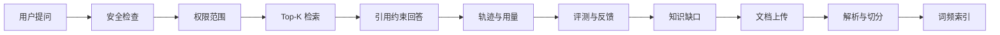

# 面试讲解要点

这份文档用于 AI 应用开发、Python 全栈开发、后端开发面试时讲解本项目。建议先用 1 分钟讲业务场景，再用 3 到 5 分钟讲技术闭环，最后根据面试官追问展开细节。

## 一句话介绍

这是一个企业知识库 RAG + AI Agent 平台，用 Python/FastAPI 实现文档入库、权限过滤、检索问答、引用溯源、Agent 工具调用、质量评测、安全审计和 AI 可观测。

## 推荐讲法

### 1. 为什么做这个项目

企业内部制度、流程、合同、项目资料通常分散在文档里，员工问问题时容易得到不一致的答案。直接把问题丢给大模型会有幻觉、越权和不可追溯问题，所以我做了一个带权限、引用、评测和审计的企业知识库问答系统。

### 2. 核心技术闭环



这条链路可以体现 AI 应用开发里的关键能力：数据准备、检索增强、权限安全、可观测、评测和持续改进。

### 3. 可以重点展示的页面

| 页面 | 面试时怎么讲 |
| --- | --- |
| 首页总览 | 展示 token、成本、Agent 运行、工具调用次数，说明不是只做 UI，而是关注 AI 应用运营 |
| 问答工作台 | 展示引用、置信度、决策轨迹和用量，说明如何降低幻觉并支持排查 |
| 智能体工作台 | 展示工具调用时间线，说明 Agent 不是黑盒，而是可追踪、可权限控制 |
| 评测中心 | 展示黄金集版本、门禁结论、失败指标和基线变化，说明如何阻止 RAG 质量随代码改动退化 |
| 知识缺口 | 展示低置信度和负反馈如何转化为知识库维护任务 |
| 审计日志 | 展示安全拦截、管理操作和问答记录，说明企业场景里的合规意识 |

## 面试官可能追问

### 你这个项目和普通 ChatGPT 套壳有什么区别？

普通套壳通常只有聊天入口，而这个项目做了企业知识库的完整工程链路：文档入库、角色权限、检索过滤、引用溯源、安全拦截、质量评测、反馈闭环、审计日志和 AI 可观测。它更接近企业内部 AI 应用，而不是单个 Prompt 页面。

### 为什么使用 RAG？

企业问答需要基于内部资料回答。RAG 可以把回答约束在命中的文档片段上，并返回引用来源，降低幻觉风险。除了相似度阈值，系统还会检查问题关键条件在 Top-K 依据中的覆盖率；例如只命中“差旅报销”但没有“火星”依据时，会拒绝拼接答案，并在轨迹中显示缺失词。

### 为什么同时保留 SQLite 向量和 pgvector？

当前已经实现 FTS5 有界关键词候选、正文 70%/标题 30% 的字段加权 BM25、本地重排和可选 Embedding 混合召回。默认 SQLite JSON 保证仓库零服务启动并承担故障降级；可选 pgvector 使用连接池与 HNSW 做真实向量 Top-K。查询先由 SQLite 根据当前角色生成允许文档 ID，再交给 pgvector 过滤；候选回载时再次关联当前 SQLite 片段，避免索引延迟和孤儿向量造成越权。检索调试会展示 BM25、Vector、Rerank、最终分数、关键词/向量实际后端、降级状态、候选数和语料总数。

### Agent 做了什么？

Agent 支持确定性规划和可选模型规划，但模型只能从工具白名单中选择。每一步都有权限判断、超时、重试、输入、输出、耗时和状态，并持久化到 `agent_runs`，方便审计和复盘。

### 如何处理权限？

系统有管理员、技术员工和普通员工角色。后端接口使用权限检查，文档检索会根据用户角色过滤可访问密级；低权限问题若明显指向受限文档主题，会在读取正文前返回通用拒答，避免从普通资料拼接出错误答案。前端也会隐藏无权限页面，但安全边界主要在后端，避免只靠 UI 隐藏。

### 如何评估回答质量？

系统支持单条评测和版本化批量门禁。v2 黄金集的 12 条用例按管理员、技术员工和普通员工角色执行；黄金集与批准基线进入 Git 并计算 SHA-256 指纹，分别计算 Recall@K、MRR、答案、拒答和访问控制准确率，避免把召回、生成和越权泄漏混成一个分数。应用优先比较兼容历史运行，CI 固定比较批准基线；CLI 失败返回非零退出码，因此 GitHub Actions 能真正阻止质量退化，而不只是展示报表。

### 如何做安全防护？

系统有 Prompt 注入拦截、敏感信息脱敏、文档密级过滤、角色权限、接口鉴权和审计日志。遇到危险提问时会拒绝回答并记录拦截原因。

### 如果接入真实大模型，需要改哪里？

系统已经保留 OpenAI 兼容接口配置：`LLM_API_KEY`、`LLM_BASE_URL`、`LLM_MODEL`。默认没有 Key 时走本地抽取式回答，配置后可以切换到真实模型生成。

## 简历写法

可以放在简历项目经历里：

```text
企业知识库 RAG + AI Agent 平台
- 基于 FastAPI + SQLite + 原生前端实现企业知识库问答系统，支持文档解析、切分、检索、引用溯源和角色权限过滤。
- 设计受控 Agent 规划与执行链路，实现工具白名单、权限校验、超时重试、失败状态和调用轨迹持久化。
- 建设 AI 可观测能力，记录问答决策轨迹、token 估算、成本估算，并在首页汇总 Agent 运行和工具调用指标。
- 实现 12 条角色化黄金集、Recall@K、MRR、答案/拒答/访问控制准确率与 CI 回归门禁，并保留知识缺口、反馈闭环和审计日志。
- 用关键条件覆盖率闸门拦截“部分词命中但核心条件缺失”的回答，避免高相似度被误当作可回答。
- 使用 pytest 覆盖 Agent、权限、评测、安全、分页、前端契约等核心场景，并通过 Playwright 验证关键页面交互。
```

## 需要诚实说明的边界

- 当前默认 SQLite JSON 向量仍会在本地扫描，适合零服务运行；大规模语料应启用 pgvector，并继续迁移单实例 SQLite 业务库。
- 默认数据库是 SQLite，更适合演示、毕业设计和小规模原型。
- 默认回答可离线运行，真实大模型能力需要配置 OpenAI 兼容 API。
- Agent 已支持进程内异步执行、超时重试、状态持久化、幂等、协作式取消和失败重试；生产环境还需要外部队列、跨实例恢复、人工审批和更完整的权限策略。

这些边界不用回避。能清楚说明取舍，反而会让项目更可信。
