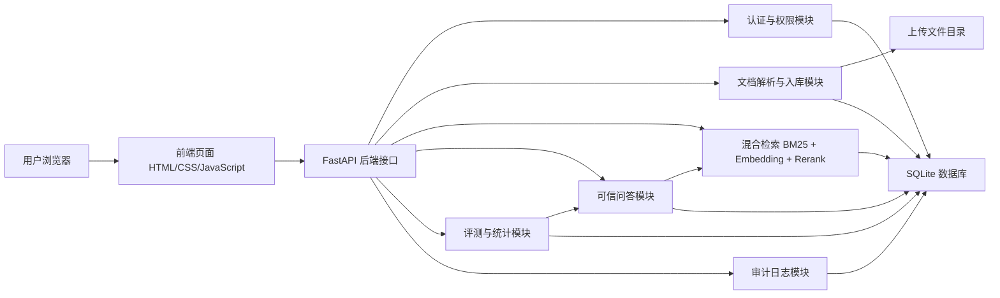
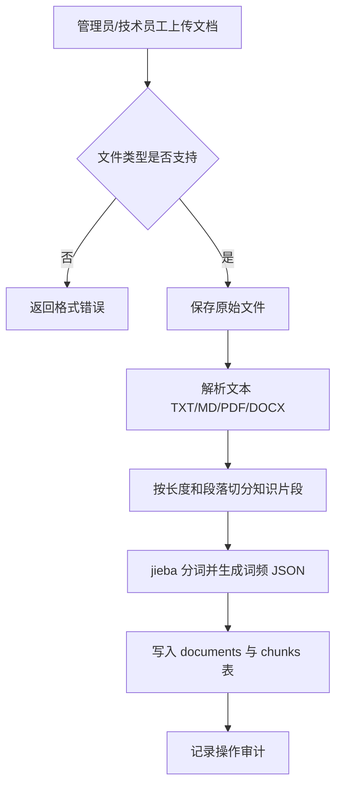
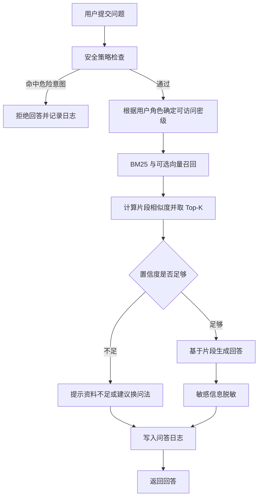
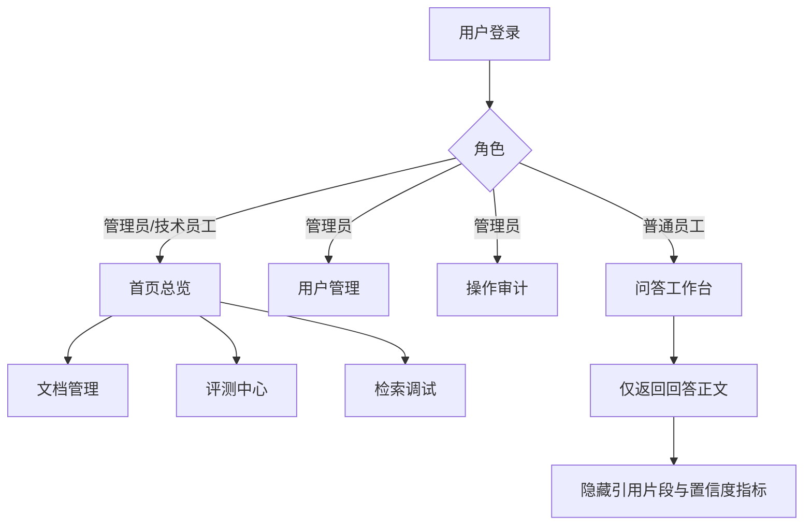

# 系统架构设计

本文档用于毕业论文的“系统设计”章节，也可作为答辩时的系统说明材料。

## 总体架构

系统采用前后端分离思想实现，本地部署时由 FastAPI 同时提供接口服务和静态前端页面。数据层使用 SQLite，适合毕业设计演示、功能验证和小规模知识库管理。

## 文档入库流程

管理员或技术员工上传企业制度、业务文档或项目资料后，系统会完成解析、清洗、切分和索引写入。普通员工不具备文档入库权限。

## 可信问答流程

问答流程以安全检查和引用约束为核心。系统先判断问题是否存在 Prompt 注入或敏感诱导，再按用户角色过滤可检索文档，最后基于命中片段生成回答。

## 权限设计

系统内置管理员、技术员工与普通员工三类角色。管理员具备完整后台权限，负责知识库治理、用户管理和操作审计；技术员工负责知识库维护、检索调试和评测；普通员工只使用问答工作台。

## 数据流说明

| 数据对象 | 来源 | 存储位置 | 主要用途 |
| --- | --- | --- | --- |
| 用户账号 | 管理员创建、系统初始化 | `users` | 登录认证和角色控制。 |
| 会话 token | 登录接口生成 | `sessions` | 接口鉴权。 |
| 原始文档 | 管理员或技术员工上传 | 上传文件目录 | 重新索引和原始资料留存。 |
| 文档元数据 | 文档入库模块 | `documents` | 文档列表、权限过滤、统计分析。 |
| 知识片段 | 文档切分模块 | `chunks` | 检索和回答依据。 |
| 问答记录 | 问答接口 | `qa_logs` | 审计、统计、质量分析。 |
| 评测记录 | 评测中心 | `evaluations`、`batch_eval_runs`、`batch_eval_results` | 测试章节和质量评估。 |
| 操作记录 | 管理员操作 | `audit_logs` | 追踪文档和用户变更。 |

## 模块职责

| 模块 | 职责 |
| --- | --- |
| 前端交互模块 | 提供登录、问答、文档管理、评测、用户管理、审计等页面。 |
| 认证权限模块 | 校验账号密码、生成会话、区分管理员、技术员工和普通员工访问范围。 |
| 文档处理模块 | 解析不同格式文档，完成文本切分、词频和可选 Embedding 索引。 |
| 检索模块 | 使用 BM25、可选向量相似度和本地重排实现 Top-K 检索。 |
| 可信问答模块 | 基于检索片段生成回答，低置信度时拒绝编造。 |
| 安全模块 | 拦截 Prompt 注入，脱敏敏感信息。 |
| 评测模块 | 按角色执行黄金用例，支持 Recall@K、MRR、答案、拒答、访问控制准确率和报告导出。 |
| 审计模块 | 保存问答日志和管理员操作记录。 |

## 设计特点

- 普通员工界面保持简洁，只开放问答工作台。
- 管理员保留完整的账号、审计和知识库治理能力，技术员工聚焦知识库维护与质量评测。
- 后端接口同样进行权限控制，避免只依赖前端隐藏。
- 回答来源以引用片段为基础，降低无依据编造风险。
- 评测结果可导出 Markdown 和 CSV，便于论文测试章节复用。
- SQLite 和本地文件存储降低部署复杂度，适合毕业设计展示。
